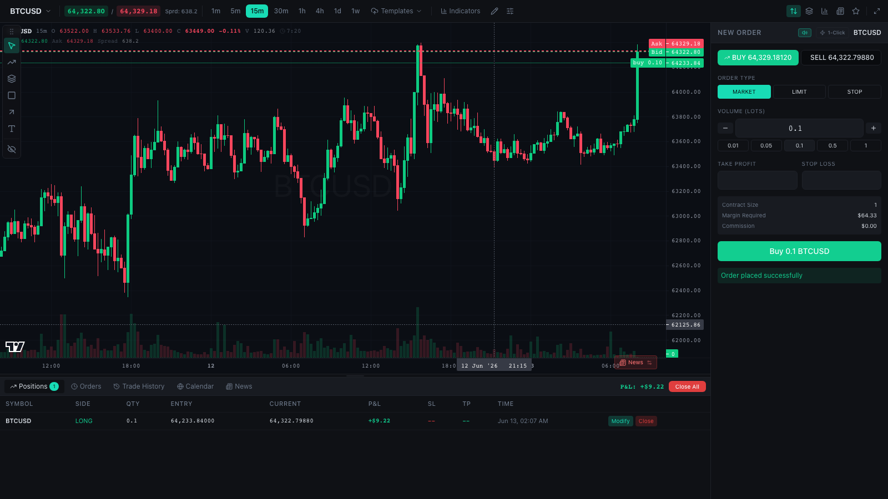

# kryptto terminal (OpenCharts × kryptto backend)

This is **OpenCharts** — the MIT-licensed open-source trading terminal
([upstream](https://github.com/dylanpersonguy/OpenCharts)) — wired to the
**kryptto backend** (`../server`): real REST trading + authenticated
WebSocket market data and account events, with a server-side paper-trading
engine.

> Upstream README continues below. All credit for the terminal UI to the
> OpenCharts project; this fork adds the backend integration layer.

## What changed in this fork

| File | Change |
|---|---|
| `src/services/ws-types.ts` | **new** — shared WebSocket client surface (both implementations conform) |
| `src/services/backend/request.ts` | **new** — HTTP client for the kryptto API (token attach, single-flight refresh, error envelope) |
| `src/services/backend/api.ts` | **new** — kryptto implementation of the OpenCharts API facade (auth, accounts, market data, orders, positions, fills, ledger, stats). Converts candle ms→s, `symbol`→`symbolName`, wraps paginations |
| `src/services/backend/ws.ts` | **new** — `KrypttoWsClient`: reconnecting WS with kryptto→OpenCharts event translation (MarketTick, CandleUpdate/Closed, OrderPlaced/Filled/Canceled, PositionOpened/Updated/Closed, EquityUpdated) |
| `src/services/demo/ws-client.ts` | extracted from `services/ws.ts` (upstream demo client, unchanged behavior + `setChartStream` no-op) |
| `src/services/api.ts` | selector: `VITE_DATA_SOURCE=kryptto` (default) → backend facade, `demo` → upstream demo layer; same benign-Proxy fallback |
| `src/services/ws.ts` | selector for the WS client |
| `src/pages/TradingPage.tsx` | focuses server candle streaming via `wsClient.setChartStream(symbol, timeframe)` |
| `src/services/store.tsx` | default symbol `BTCUSD` → `BTCUSDT` (kryptto symbol universe) |
| `vite.config.ts` | dev proxy `/api` + `/ws` → `http://localhost:8080`, bind `0.0.0.0` |
| `src/__tests__/kryptto-ws-client.test.ts` | **new** — unit tests for the event translation layer |

## Run against the kryptto backend

```bash
# 1. start the backend (terminal 1)
cd ../server && npm install && npm run build && npm start   # :8080

# 2. start the terminal (terminal 2)
npm install && npm run dev                                  # :5173, proxies /api + /ws
```

Open http://localhost:5173 — the app boots a one-click demo session
(`POST /api/auth/demo`) with a $100k paper account and live market data
(Binance when reachable, the built-in simulator otherwise — see
`GET /api/status`).

Environment (none required for the default proxy setup):

| Variable | Default | Purpose |
|---|---|---|
| `VITE_DATA_SOURCE` | `kryptto` | `kryptto` \| `demo` (upstream in-browser demo) |
| `VITE_API_URL` | – | Direct backend URL (e.g. `http://localhost:8080`) — skips the dev proxy |
| `VITE_WS_URL` | derived | Direct WebSocket base (e.g. `ws://localhost:8080`) |

## Backend-mode notes

- Bar replay, the trade journal and leaderboards remain demo/empty — kryptto
  doesn't implement those endpoints; their calls fail soft.
- The upstream `npm run typecheck` is not clean upstream (151 pre-existing
  errors); this fork adds none — the new files are type-clean and `npm run
  build` + `npm test` (34 tests) are the gates.

---

<div align="center">

# 📈 OpenCharts

**An open-source trading terminal that runs entirely in your browser — no backend to run, no signup, no API keys.**

Advanced charting · full drawing-tool suite · 8 indicators · watchlist · depth-of-market · order ticket · built-in paper-trading engine, seeded with **real** market history.



</div>

---

## Table of contents

- [What is OpenCharts?](#what-is-opencharts)
- [Features](#features)
- [Quick start](#quick-start)
- [What's real and what's simulated](#whats-real-and-whats-simulated)
- [How it works](#how-it-works)
- [Built on Lightweight Charts](#built-on-lightweight-charts)
- [Project structure](#project-structure)
- [Building on OpenCharts](#building-on-opencharts)
- [Refreshing the bundled market data](#refreshing-the-bundled-market-data)
- [Bring your own data / backend](#bring-your-own-data--backend)
- [Adding instruments](#adding-instruments)
- [Configuration](#configuration)
- [Scripts](#scripts)
- [Tech stack](#tech-stack)
- [Known limitations](#known-limitations)
- [Contributing](#contributing)
- [Acknowledgements](#acknowledgements)
- [License](#license)

---

## What is OpenCharts?

OpenCharts is a self-contained **trading terminal UI**. Open it and you land
straight in the terminal: a candlestick chart with a TradingView-style drawing
toolbar, indicators, a watchlist, a depth-of-market ladder and an order ticket —
all wired to an **in-browser paper-trading engine** funded with $100,000.

There is **no server to run**. The session is seeded with *genuine* historical
OHLC pulled from Binance's public klines endpoint at build time, and a tick
stream is replayed forward from the present, so the chart and prices move like a
live feed while you place and manage paper trades.

It's useful as:

- A **standalone charting / paper-trading app** you can host on any static host.
- A **reference terminal UI** you can point at your own market-data and trading
  backend — the data layer is isolated behind two modules
  (see [Bring your own data](#bring-your-own-data--backend)).
- A **learning sandbox** for charting, technical drawing and order management.

The codebase was extracted from a closed-source prop-trading platform, so a few
panels are gated off or stubbed rather than removed — those are called out
explicitly below rather than advertised as features.

**This is a community project.** The goal is a genuinely open trading terminal
interface — beautiful charts, a deep drawing toolkit, and enough customizability
that you can bend it into your own terminal instead of fighting it. It is
deliberately small, dependency-light and backend-agnostic so that anyone can
clone it, understand it in an afternoon and extend it. Contributions of every
size are welcome, from a new indicator or drawing tool to an exchange adapter,
a theme, a bug report or a docs fix — see
[Building on OpenCharts](#building-on-opencharts) and
[Contributing](#contributing).

## Features

### 📊 Charting
- Candlestick chart powered by [`lightweight-charts`](https://github.com/tradingview/lightweight-charts) v4 with custom plugins.
- Timeframes **1m → 1w** (1m, 5m, 15m, 30m, 1h, 4h, 1d, 1w), up to 1000 bars per
  timeframe (fewer where the exchange has less history, e.g. 461 weekly bars).
- Volume histogram, OHLC legend, live bid/ask price lines, crosshair and bar countdown.
- Toggleable chart plugins: crosshair highlight, session highlighting, session
  breaks, bands indicator, OHLCV tooltip and delta (multi-touch) tooltip.
- Chart settings dialog, right-click context menu, per-symbol preferences and
  saveable **chart templates** — all persisted to `localStorage`.

### 📐 Indicators
SMA, EMA, RSI, MACD, Bollinger Bands, ATR, Stochastic and VWAP, added from the
toolbar and removable individually or in bulk from the chart context menu.

### ✏️ Drawing tools
- Draggable, hideable tool rail grouped into **Lines** (trend line, ray, extended
  line, horizontal, vertical, parallel channel), **Fibonacci** (retracement,
  extension), **Shapes** (rectangle, ellipse, triangle, arrow), **Trade**
  (long position, short position, measure) and **Text**.
- Position tools show risk, R:R and position size against live account equity;
  trend lines show Δprice / Δ% / bar count while being drawn or selected.
- Per-object styling (color, width, line style, labels) with a TradingView-style
  text editor, magnet mode (off / weak / strong snapping to OHLC), Shift for 45°
  angle snapping and multi-select, and keyboard shortcuts (`Alt+H`, `Alt+T`,
  `Alt+F`, `Alt+R`, `Alt+M`).
- An **object tree** panel to select, toggle and delete drawings.
- **Line-cross alerts**: enable an alert on a horizontal line or trend line and
  the chart fires an in-session toast + sound when the mid price crosses it
  (in-session only — nothing is persisted or delivered offline).
- Drawings persist per symbol in `localStorage` and survive reloads.

### 📋 Watchlist · DOM · order ticket
- **Watchlist** with live prices across all bundled instruments.
- **Depth-of-market ladder** around the live mid price.
- **Order ticket**: market / limit / stop tickets with volume presets,
  take-profit and stop-loss, one-click trade mode and an order confirmation
  dialog. See [what's simulated](#whats-real-and-whats-simulated) for how
  limit/stop tickets currently behave.
- **Positions / Orders / Trade History** tabs with modify, close, partial close
  and close-all, plus **Calendar** (TradingView embed) and **News** tabs.
- Drag stop-loss / take-profit levels directly on the chart.
- Trade execution sound (mutable), connection indicator, market-closed banner
  and a dedicated mobile trading panel for narrow screens.

### 💵 Built-in paper trading
- $100,000 starting balance, 100× leverage, no commission or swap.
- Orders fill against an in-browser engine at the latest replayed price.
- Positions are **marked to market on every tick** with running P&L.
- Stop-loss / take-profit are evaluated automatically and close positions when hit.
- Account equity, balance, used and free margin update in real time.

### 🛰️ Real market data, no backend
- Bundled OHLC is **real** historical data fetched at build time — no random walks.
- A replay feed streams those closes forward from "now" so the terminal feels live.
- Everything runs client-side — deploy it as a static site.

## Quick start

> Requires **Node 20+**.

```bash
npm install
npm run dev
```

Open the printed local URL (e.g. `http://localhost:5173`). The app boots straight
into a session with a funded paper account — pick a symbol from the watchlist,
set a size in the order ticket, and go long or short.

To build for production:

```bash
npm run build      # outputs to dist/
npm run preview    # serve the production build locally
```

## What's real and what's simulated

OpenCharts is a paper terminal, and being precise about this matters more than
marketing copy:

| Piece | Status |
| --- | --- |
| OHLC history (6 crypto pairs × 8 timeframes) | **Real** Binance klines, bundled as JSON |
| Tick feed | **Real** 1m closes, replayed on a 600 ms loop and looped when exhausted |
| Bar timestamps | **Shifted** so the last real bar lands on the current period |
| Bid/ask spread | **Derived** — synthesized around the replayed close |
| DOM ladder sizes | **Synthetic** — random sizes around the real mid price |
| Order fills, positions, P&L, margin | Real arithmetic against the in-browser engine |
| Limit / stop orders | Accepted by the ticket but **fill immediately** — there is no resting-order book |
| Order modify / cancel-all | **No-ops** in the demo engine |
| News tab | **Placeholder headlines**, not a live feed |
| Economic calendar tab & technical-analysis gauge | TradingView embed widgets — real data, loaded from TradingView's CDN |
| Trade journal, trade calculator, AI trader, session replay | **Present in the code but not reachable** — journal and replay are flagged off pending QA, the AI trader is a stub, the calculator is never mounted |
| Account state (balance, positions, orders) | In-memory — **resets on reload** |
| Drawings, chart prefs, templates, sound mute | Persisted in `localStorage` |

## How it works

The UI is **backend-agnostic**. It talks to two service modules — a REST-shaped
`api` and a streaming `wsClient` — and never cares where the data comes from. In
this repo both are implemented by a small in-browser **demo layer**:

```
                ┌─────────────────────────────────────────────┐
                │                Terminal UI                    │
                │  ChartPanel · OrderPanel · DOM · Watchlist     │
                └───────────────┬───────────────┬──────────────┘
                                │ api.*          │ wsClient.subscribe()
                ┌───────────────▼───────┐ ┌──────▼───────────────┐
                │   services/api.ts      │ │   services/ws.ts      │
                │  (REST-shaped facade)  │ │  (streaming client)   │
                └───────────────┬───────┘ └──────┬───────────────┘
                                │                 │
                ┌───────────────▼─────────────────▼───────────────┐
                │                services/demo/                    │
                │  api.ts      demo method table (+ benign fallback)│
                │  engine.ts   paper trading (positions, P&L, SL/TP)│
                │  feed.ts     replays real ticks → bus → store     │
                │  candles.ts  serves bundled OHLC (shifted to now) │
                │  bus.ts      in-process pub/sub                   │
                │  instruments.ts / data/  real OHLC + symbol specs │
                └──────────────────────────────────────────────────┘
```

- **`services/demo/engine.ts`** — the paper-trading engine and single source of
  truth for the account, positions and orders. It marks positions to market and
  publishes the same position / order / equity events the UI already consumed.
- **`services/demo/feed.ts`** — replays the bundled 1-minute closes for every
  symbol as a forward-moving tick stream, every 600 ms, and drives
  `engine.mark()`.
- **`services/demo/candles.ts`** — serves the bundled history, time-shifted so
  the most recent bar aligns to "now" (OHLC values stay real; only the timeline
  is normalized).
- **`services/api.ts`** — wraps the demo method table in a `Proxy` whose fallback
  resolves any unimplemented method to `null`, so leftover calls from the
  platform this was extracted from never throw.
- **`services/ws.ts`** — exposes the same `connect` / `subscribe` /
  `subscribeAccounts` / `onStateChange` surface as the original reconnecting
  WebSocket client, backed by the in-process bus.

Because the data layer sits behind a stable interface, **no UI component had to
change** to run without a server.

## Built on Lightweight Charts

OpenCharts is **built on top of TradingView's
[Lightweight Charts™](https://github.com/tradingview/lightweight-charts)**
(`lightweight-charts` `^4.2.0`, resolved to 4.2.3 in the lockfile, which in turn
pulls in `fancy-canvas`, MIT). The chart canvas, series, panes, price scales,
crosshair and time axis are all
Lightweight Charts. OpenCharts is the terminal *around* it: the drawing engine
(`src/lib/chart-plugins/drawing-tools/`), the indicator layer, the series
primitives, and the panels, order flow and paper engine that surround the chart.

Several plugins under `src/lib/chart-plugins/` (`plugin-base.ts`, `tooltip/`,
`delta-tooltip/`, `session-highlighting/`, `session-breaks/`,
`bands-indicator/`, `highlight-bar-crosshair/`, `helpers/`) are adapted from the
`plugin-examples` shipped in the Lightweight Charts repository, and carry that
project's license.

### Licensing — read this before you fork or deploy

- **Lightweight Charts is open source under the
  [Apache License 2.0](https://github.com/tradingview/lightweight-charts/blob/master/LICENSE)** —
  free for commercial use, but Apache 2.0 comes with conditions.
- **Attribution is required.** TradingView's terms state that you must add the
  attribution notice from their `NOTICE` file and a link to
  <https://www.tradingview.com/> on the page of your site or app that users see.
  The notice reads:

  ```
  TradingView Lightweight Charts™
  Copyright (с) 2025 TradingView, Inc. https://www.tradingview.com/
  ```

- **OpenCharts satisfies this via the chart's built-in attribution logo.** The
  `attributionLogo` layout option defaults to `true` and this project never
  overrides it, so the TradingView link renders on the chart pane. **Do not set
  `attributionLogo: false` unless you place the notice and link somewhere else
  users can see.** The option is set (or, here, left alone) where the chart is
  created in [`src/pages/trading/ChartPanel.tsx`](src/pages/trading/ChartPanel.tsx).
- **Keep the notice when you redistribute.** Apache 2.0 requires that you pass
  along the license and notice with any copy or derivative — that includes the
  adapted plugin code in `src/lib/chart-plugins/`.
- **OpenCharts' own code is MIT** (see [LICENSE](LICENSE)). MIT and Apache 2.0
  are compatible, so a build that combines them is fine — you just have to honor
  Apache 2.0's attribution and notice terms for the chart portion.

None of this is legal advice; if you are shipping commercially, read the license
yourself.

## Project structure

```
src/
├─ App.tsx                  # boots the demo session, renders the terminal
├─ main.tsx                 # React entry, providers, MarketDataBridge, chunk-reload guard
├─ pages/
│  ├─ TradingPage.tsx       # the full terminal layout (~700 lines)
│  ├─ AiTraderPage.tsx      # stub — the AI trader is gated off
│  └─ trading/              # chart, toolbars, order panel, DOM, watchlist,
│                           #   drawing rail, object tree, replay HUD/scrubber,
│                           #   news overlay, indicators, challenge levels
├─ lib/
│  ├─ chart-plugins/        # lightweight-charts plugins used by the chart
│  │  ├─ drawing-tools/      #   manager, renderers, hit-testing, geometry, alerts
│  │  ├─ delta-tooltip/ tooltip/ highlight-bar-crosshair/
│  │  └─ session-breaks/ session-highlighting/ bands-indicator/
│  ├─ indicators.ts         # SMA/EMA/RSI/MACD/BOLL/ATR/STOCH/VWAP
│  ├─ livePnl.ts            # live P&L / price math shared by the tables
│  ├─ posthog.ts            # optional analytics (no-op without an API key)
│  └─ utils.ts
├─ components/              # dialogs, mobile panel, TradingView embeds, ui primitives
├─ hooks/                   # drawings, chart prefs, trader prefs, trade sound…
├─ services/
│  ├─ api.ts                # REST-shaped facade (demo-backed)
│  ├─ ws.ts                 # streaming client (demo-backed)
│  ├─ api/                  # legacy HTTP clients from the original platform;
│  │                        #   chart-templates.ts is localStorage-backed and live
│  ├─ queries.ts            # TanStack Query hooks
│  ├─ store.tsx             # zustand stores (auth + trading state)
│  ├─ schemas.ts            # zod schemas / shared types
│  └─ demo/                 # engine, feed, candles, bus, instruments, bundled data
├─ __tests__/               # Vitest unit tests
└─ styles/
scripts/
└─ fetch-demo-data.mjs      # refresh the bundled real OHLC
```

## Building on OpenCharts

Everything below is a real extension point in the code, not a roadmap. `npm run
typecheck` and `npm run test` are the two gates; TypeScript runs in `strict` mode
with `noUncheckedIndexedAccess` and `noUnusedLocals`, and `@/` resolves to
`src/`.

### Add an indicator

1. Write the pure calculation in [`src/lib/indicators.ts`](src/lib/indicators.ts)
   (they take candles and return `{ time, value }[]` — copy `sma` or `rsi`).
2. Add the type to the `IndicatorType` union and an entry to
   `INDICATOR_REGISTRY` (`label`, `pane: "overlay" | "below"`, `defaultParams`,
   `color`). The toolbar menu renders straight from the registry.
3. Render it in [`src/pages/trading/useIndicators.ts`](src/pages/trading/useIndicators.ts),
   which creates and disposes the Lightweight Charts series per active indicator.

### Add a drawing tool

The drawing engine is custom and lives in
[`src/lib/chart-plugins/drawing-tools/`](src/lib/chart-plugins/drawing-tools/).
A new tool touches five places:

| File | What you add |
| --- | --- |
| `pages/trading/constants.ts` | the tool name in the `DrawingTool` union and any new fields on `DrawingLine` |
| `drawing-tools/manager.ts` | a branch in `buildNew()` that turns anchor points into a `DrawingLine`, plus the single-click list in the pointer handler if it is a one-click tool |
| `drawing-tools/renderers.ts` | a `case` in the render switch that paints it |
| `drawing-tools/hit-test.ts` | a `case` so it can be selected and dragged |
| `pages/trading/DrawingToolRail.tsx` | the rail button, icon and group |

`geometry.ts` holds the shared math, `types.ts` the resolved (pixel-space)
shapes. Drawings are plain JSON, so anything you add persists automatically.

### Add a chart plugin

Extend `PluginBase` from
[`src/lib/chart-plugins/plugin-base.ts`](src/lib/chart-plugins/plugin-base.ts)
(the Lightweight Charts `ISeriesPrimitive` contract: pane views + renderers),
attach it where the other primitives are attached in `ChartPanel.tsx`, then add
it to the plugin list in `ChartToolbar.tsx` so it gets a toggle. The existing
six plugins are the reference implementations.

### Where state lives

- **Zustand** (`services/store.tsx`) — auth and trading state (symbols, accounts,
  selected symbol, live ticks).
- **TanStack Query** (`services/queries.ts`) — everything fetched through `api`,
  keyed by `queryKeys`.
- **The demo bus** (`services/demo/bus.ts`) — `market-data`, `positions`,
  `orders` and `account` events; `components/MarketDataBridge.tsx` is the single
  place they land in React.
- **`localStorage`** — drawings (`oc_drawings_<SYMBOL>`), chart templates
  (`oc_chart_templates`), chart and trader preferences (`trader_prefs`, scoped
  per user id) and the sound mute flag (`tradeSoundMuted`). Chart preference
  changes broadcast a `chart-preferences-updated` window event rather than
  going through a store.

### Gotchas worth knowing

- **`api` swallows unknown methods.** [`services/api.ts`](src/services/api.ts)
  wraps the demo table in a `Proxy` that resolves *any* unimplemented method to
  `null`. A typo'd method name fails silently instead of throwing — check
  `services/demo/api.ts` when a call mysteriously returns nothing.
- **Flags gate whole panels.** `REPLAY_ENABLED` in `pages/trading/constants.ts`
  hides the replay HUD and scrubber; the journal tab is commented out in
  `BottomPanel.tsx`; the AI trader is a `null`-returning stub.
- **React runs in `StrictMode`**, so chart effects mount twice in development —
  every series, primitive and subscription needs a working cleanup path.
- **The demo engine is in-memory.** Anything you want to survive a reload has to
  be written to `localStorage` (or a backend you wire up yourself).

## Refreshing the bundled market data

The demo OHLC lives in `src/services/demo/data/` as JSON, fetched from the public
**Binance klines** endpoint (no API key required):

```bash
node scripts/fetch-demo-data.mjs
```

This re-pulls up to 1000 bars per symbol per timeframe and rewrites the bundled files
plus `data/manifest.json`. The candles are genuine market history — OpenCharts
never ships synthetic OHLC.

## Bring your own data / backend

To connect OpenCharts to real (or your own simulated) data, implement two files
against your APIs — the rest of the app is untouched:

1. **`src/services/api.ts`** — the request/response methods the UI calls
   (`getSymbols`, `getCandles`, `placeOrder`, `getPositions`, `closePosition`, …).
   `src/services/demo/api.ts` is the complete list of what the terminal actually
   reaches for; the expected shapes are in `src/services/schemas.ts`.
2. **`src/services/ws.ts`** — a client exposing
   `connect` / `subscribe(channel, handler)` / `subscribeAccounts` / `onStateChange`.
   Publish `MarketTick`, `CandleUpdate`, `Position*`, `Order*` and `EquityUpdated`
   events on the `market-data` / `positions` / `orders` / `account` channels.

`src/components/MarketDataBridge.tsx` shows exactly which events the UI consumes.

Two leftovers from the original platform help if you go this route:
`src/services/api/request.ts` is a working HTTP client with token refresh, and
the Vite dev server already proxies `/api` and `/ws` to `http://localhost:3000`.

## Adding instruments

Demo instruments are defined in `src/services/demo/instruments.ts` (currently
BTCUSD, ETHUSD, SOLUSD, BNBUSD, XRPUSD and ADAUSD). To add one:

1. Add a `Symbol` entry (name, tick size, contract size, etc.).
2. Add its trading pair to the `SYMBOLS` map in `scripts/fetch-demo-data.mjs`.
3. Run `node scripts/fetch-demo-data.mjs` to fetch and bundle its history.

## Configuration

Everything works with no configuration. Optional environment variables:

| Variable | Effect |
| --- | --- |
| `VITE_POSTHOG_API_KEY` | Enables PostHog analytics. **Unset (the default) means analytics are never initialized and nothing leaves the browser.** |
| `VITE_POSTHOG_HOST` | PostHog host, defaults to `https://us.i.posthog.com` |
| `VITE_API_URL` | Base URL used by the legacy HTTP client in `src/services/api/` |

Note that the Calendar tab and the technical-analysis gauge load TradingView's
embed scripts from TradingView's CDN — they need no key, but they are third-party
network requests. Drop those components if you want a strictly offline build.

## Scripts

| Command | Description |
| --- | --- |
| `npm run dev` | Start the Vite dev server |
| `npm run dev:ci` | Dev server bound to `0.0.0.0:5173` |
| `npm run build` | Production build to `dist/` |
| `npm run preview` | Preview the production build |
| `npm run typecheck` | Type-check the project with `tsc` |
| `npm run test` | Run the Vitest unit tests |
| `npm run test:watch` | Run tests in watch mode |
| `npm run lint` | Runs `eslint src/` — ESLint is **not** currently a declared dependency, so install it first |
| `node scripts/fetch-demo-data.mjs` | Refresh bundled real OHLC |

## Tech stack

- **React 19** + **TypeScript 5.7** + **Vite 6**
- **lightweight-charts 4** (+ custom plugins) for the chart
- **Zustand** for state, **TanStack Query** for caching
- **Tailwind CSS 3** + **Radix UI** primitives + **lucide-react** icons
- **Zod** in `services/schemas.ts` as the shared type source (types are inferred
  from the schemas; nothing is parsed at runtime)
- **Vitest** + **Testing Library** for tests
- Optional **posthog-js** analytics, off unless a key is set

`package.json` also declares `framer-motion`, `html-to-image`,
`@tanstack/react-virtual` and `react-router-dom`; the first three are unused and
React Router only supplies a `BrowserRouter` wrapper — there are no routes.

## Known limitations

- **No resting orders.** The demo engine fills every ticket immediately; limit
  and stop prices are accepted but not worked. `modifyOrder` and
  `cancelAllOrders` are no-ops.
- **Account state is ephemeral** — positions, orders and balance reset on reload.
  Drawings, chart preferences and templates persist via `localStorage`.
- **Timeline is normalized** — bundled history is shifted so the latest bar is
  "now", and the tick replay loops when it reaches the end of the 1m series.
  OHLC values are real; the timestamps are remapped to feel live.
- **The DOM ladder is synthetic** — real mid price, random sizes. There is no
  order book in the bundled data.
- **Crypto-only demo symbols** out of the box (the data source is Binance). Wire
  your own adapter for FX, futures or equities.
- **Dormant code from the original platform** ships in the repo: session replay
  (`REPLAY_ENABLED = false`), the trade journal (hidden pending QA), the trade
  calculator (never mounted), the AI trader (stubbed), challenge/risk-rule price
  levels (inert because the demo account reports no risk limits), unused
  marketing assets under `public/`, and four dependencies nothing imports.
- **Thin test coverage** — the Vitest suite covers `lib/utils` and the button
  component only. Playwright is a declared dev dependency but no end-to-end
  specs are checked in.
- The production `build` runs Vite only; run `npm run typecheck` separately for
  full type checking.

## Contributing

OpenCharts is a community project and it is open to anyone who wants to make it
better — there is no core team you need permission from. Issues, pull requests,
questions and design opinions are all welcome, and small first contributions are
genuinely useful.

Good places to start:

- **Indicators and drawing tools** — the two most self-contained additions; see
  [Building on OpenCharts](#building-on-opencharts).
- **A real resting-order book** in the demo engine, so limit and stop orders
  actually work.
- **Persistence for the paper account**, so a session survives a reload.
- **Data adapters** for other exchanges or brokers, behind the existing
  `api` / `wsClient` interfaces.
- **Themes and layout customization** — the chart palette lives in
  `pages/trading/constants.ts` and the design tokens in `tailwind.config.js`.
- **Finishing or removing the dormant panels** listed under
  [Known limitations](#known-limitations).
- **Tests, docs and bug reports** — coverage is thin and every report helps.

Before opening a PR, run `npm run typecheck` and `npm run test`, and keep changes
to the demo layer behind the `api` / `wsClient` interfaces so the terminal stays
backend-agnostic.

## Acknowledgements

OpenCharts stands on TradingView's open-source
[Lightweight Charts™](https://github.com/tradingview/lightweight-charts), which
renders every chart here, and on the plugin examples shipped in that repository.
Thank you to TradingView for releasing it under a permissive license.

## License

OpenCharts is released under the **MIT License** — see [LICENSE](LICENSE).

It bundles TradingView's Lightweight Charts™, which is licensed under the
**Apache License 2.0** and requires that you keep its attribution notice and a
link to <https://www.tradingview.com/> visible to your users. See
[Built on Lightweight Charts](#built-on-lightweight-charts) for what that means
in practice before you deploy or redistribute a fork.
